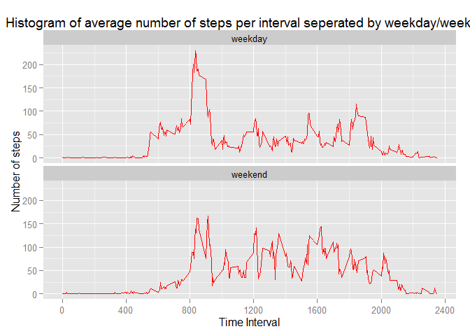

# PeerAssessment1
##Loading and preprocessing the data

First, it is necessary to set your working directory and load the dataset. The `options` function is used to turn off scientific notation so that values throughout this document are reported in a way that is easier to understand.


```r
setwd("~/GoogleDrive/R/ReproducibleResearch")
activity = read.csv("~/GoogleDrive/R//ReproducibleResearch/activity.csv", sep=',', header=TRUE)
options(scipen = 999)
```

Then, look at the dataset to see the variables and their attributes.


```r
str(activity)
```

```
## 'data.frame':	17568 obs. of  3 variables:
##  $ steps   : int  NA NA NA NA NA NA NA NA NA NA ...
##  $ date    : Factor w/ 61 levels "2012-10-01","2012-10-02",..: 1 1 1 1 1 1 1 1 1 1 ...
##  $ interval: int  0 5 10 15 20 25 30 35 40 45 ...
```

The date variable is a factor that can be converted to a date format. The interval variable is an integer that can be converted to a factor. These changes will help with analyses later. The number of steps variable is a numeric variable that does not need to be changed.


```r
activity$date = as.Date(activity$date, format = "%Y-%m-%d")
activity$interval = as.factor(activity$interval)
```


##What is the mean total number of steps taken per day?

Now, calculate the total number of steps taken per day. This can be done using the `data.table` package.


```r
library(data.table)
StepsPerDay = data.table(activity)
StepsPerDay = StepsPerDay[,list(steps = sum(steps, na.rm=TRUE)), by = 'date']
```

A histogram can be used to show the distribution of the total number of steps taken each day. Along the x-axis is the number of steps taken per day, and along the y-axis is the number of times a day that an individual took that many steps on a given day. This histogram uses the `ggplot2` package.


```r
library(ggplot2)
HistSteps = ggplot(StepsPerDay, aes(x = steps)) + geom_histogram(color = "blue", fill = "blue", binwidth = 800) + labs(x = "Steps per day", y = "Frequency", title = "Histogram of total number of steps per day") + scale_y_continuous(breaks=seq(0,10,1)) + scale_x_continuous(breaks=seq(0,22000,2000))
print(HistSteps)
```

 

Finding the mean and median can give some more information about the distribution. In the calculation below, the mean and median are calculated with the missing values removed from the data.


```r
MeanNumberSteps = mean(StepsPerDay$steps, na.rm = TRUE)
MedianNumberSteps = median(StepsPerDay$steps, na.rm = TRUE)
```

The mean number of steps taken per day was 9354.23, and the median number of steps taken per day was 10395.

##What is the average daily activity pattern?

The average number of steps can be calculated by 5-minute time intervals throughout the day. This can also be done using the `data.table` package, but this time the data is aggregated by the interval number rather than the day. Also, a mean rather than a sum is calculated. Note that the interval variable was converted to numeric so that the x-axis on the plot below could be modified. 


```r
StepsPerInterval = data.table(activity)
StepsPerInterval = StepsPerInterval[,list(steps = mean(steps, na.rm=TRUE)), by = 'interval']
StepsPerInterval$interval=as.numeric(levels(StepsPerInterval$interval))[StepsPerInterval$interval]
```

The plot below shows the distribution of the mean number of steps taken during 5-minute intervals throughout the day. Along the x-axis is the time interval, and along the y-axis is the average number of steps an individual took at each 5-minute time interval. 


```r
IntervalSteps = ggplot(StepsPerInterval, aes(x=interval, y = steps, group = 1)) + geom_line(color = "red") + labs(x = "Time Interval", y = "Number of steps", title = "Histogram of average number of steps per interval") + scale_x_continuous(breaks=seq(0,2400,400))
print(IntervalSteps)
```

 

This shows that there are average number of steps in different time intervals throughout the day. It may be useful to determine which time interval has the maximum average number of steps.


```r
MaxIntervalSteps = with(StepsPerInterval, interval[steps == max(steps)])
```
The time interval with the highest average number of steps is the time interval 835.

##Imputing missing values

This dataset has many missing values.


```r
NumMissing = sum(is.na(activity$steps))
```

There are 2304 missing values in this dataset. These missing numbers can be imputed by filling in the average number of steps for that interval based on other individuals.


```r
activityNoNA = activity
for (i in 1:nrow(activityNoNA)) {
      if (is.na(activityNoNA$steps[i])) {
            intervalnumber = activityNoNA$interval[i]
            imputedsteps = subset(StepsPerInterval, interval==intervalnumber)
            activityNoNA$steps[i] = imputedsteps$steps
      }
}
```

A histogram, the mean, and the median can show a distribution of the data once the missing values are imputed.The histogram axes will be the same (the x-axis is the number of steps taken per day, and the y-axis is the number of times a day that an individual took that many steps on a given day).


```r
StepsPerDayNoNA = data.table(activityNoNA)
StepsPerDayNoNA = StepsPerDayNoNA[,list(steps = sum(steps)), by = 'date']

HistStepsNoNA = ggplot(StepsPerDayNoNA, aes(x = steps)) + geom_histogram(color = "red", fill = "red", binwidth = 800) + labs(x = "Steps per day", y = "Frequency", title = "Histogram of total number of steps per day") + scale_y_continuous(breaks=seq(0,10,1)) + scale_x_continuous(breaks=seq(0,22000,2000))
print(HistStepsNoNA)

MeanNumberStepsNoNA = mean(StepsPerDayNoNA$steps)
MedianNumberStepsNoNA = median(StepsPerDayNoNA$steps)
```

 

The mean before imputation (9354.23) and the mean after imputation (10766.19) differ. The the median before (10395) and after (10766.19) imputation also differ. Both of these values are higher after imputation.

##Are there differences in activity patterns between weekdays and weekends?

The data can also be seperated into weekend and weekday to see if individuals take a different average number of steps throughout the time intervals in the day depending if it is a weekend or weekday.


```r
activityNoNA$weekday = ifelse(weekdays(activityNoNA$date)=="Saturday" | weekdays(activityNoNA$date)=="Sunday", "weekend", "weekday")
```

The data can then by aggregated to find the average number of steps, but this time the data is aggregated by both the time interval and the weekday (or weekend) variable.


```r
WeekdayStepsPerInterval = data.table(activityNoNA)
WeekdayStepsPerInterval = WeekdayStepsPerInterval[,list(steps = mean(steps, na.rm=TRUE)), by = c('interval', 'weekday')]
WeekdayStepsPerInterval$interval=as.numeric(levels(WeekdayStepsPerInterval$interval))[WeekdayStepsPerInterval$interval]
```

The data can then be plotted using the `facet_wrap` function of `ggplot2` to seperate the graph by the type of day.


```r
WeekdayIntervalSteps = ggplot(WeekdayStepsPerInterval, aes(x=interval, y = steps, group = 1)) + geom_line(color = "red") + labs(x = "Time Interval", y = "Number of steps", title = "Histogram of average number of steps per interval seperated by weekday/weekend") + scale_x_continuous(breaks=seq(0,2400,400)) + facet_wrap (~ weekday, ncol=1)
print(WeekdayIntervalSteps)
```

 

This graph shows that individuals seem to take more steps after waking up on the weekends, but that they make wake up (and get moving) later in the day.


